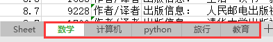
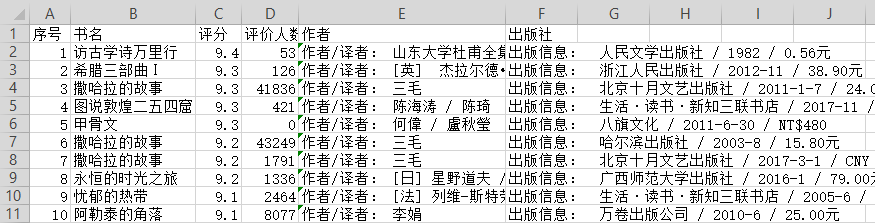
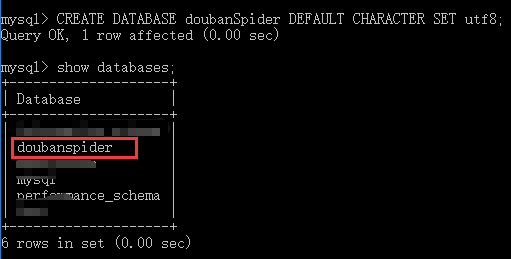
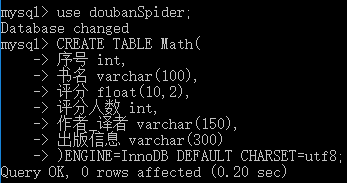
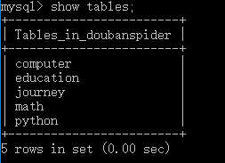
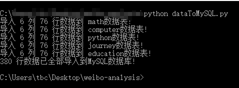
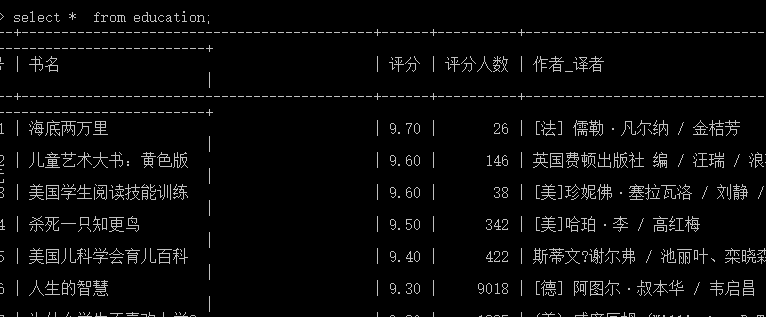
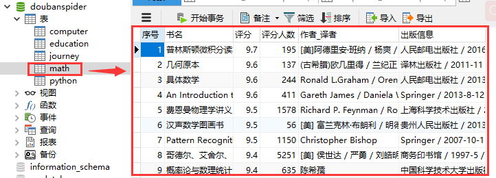

# DoubanSpider
这是一个豆瓣图书爬取项目，将图书的相关信息爬取到Excel文件中，
然后再链接MySQL数据库，将爬取到的数据存入数据库中。  
----
**1. 爬取数据**  
主要爬取了**数学、计算机、python、旅行、教育**这5个类别的书籍数据（每个类别爬取了5页数据），
每一组书籍数据包括：**序号,书名,评分,评价人数,作者,出版社**这几个属性。  
  
  
可以看到在爬取的过程之中，会有请求失败的情况，因为频繁的网页请求访问很有可能会被限制  
----
**2. 数据存储**  
在爬取了相关数据后，在当前目录下生成了一个**Excel表格**  
  
并且在Excel文件中生成了对应的5个**工作表**  
  
每个工作表对应的数据就是我们所爬取的**原始数据**。  
  
----
**3. 数据入库**  
对于生成的原始数据，在进行相关的过滤和处理之后，将其**导入到数据库**中，以便后续进行操作。  
从下图可以看出，我们新建了一个数据库DoubanSpider，然后建立了相关的数据表  
  
  
  
  
在python对MySQL的操作中，需要注意的是字符集的问题，这里我们使用**UTF-8**  
  
  
添加完成后可以直接查看是否添加正确  
  
----
使用MySQL界面管理工具查看数据更加清晰明了  

----
@Author:[Freator](https://github.com/Freator)  
@Email:tbcong@qq.com
